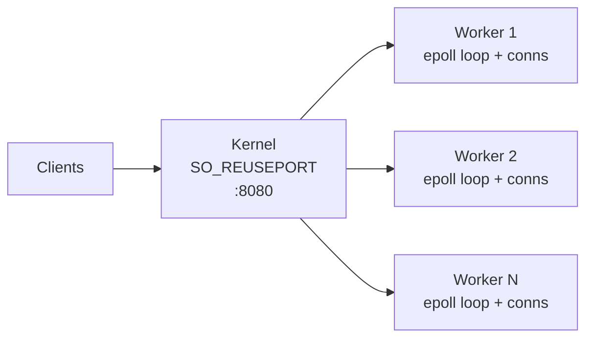
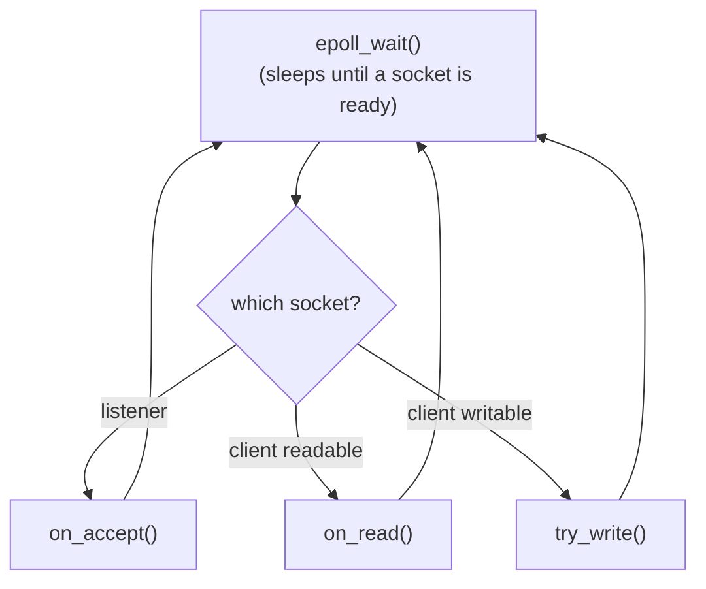
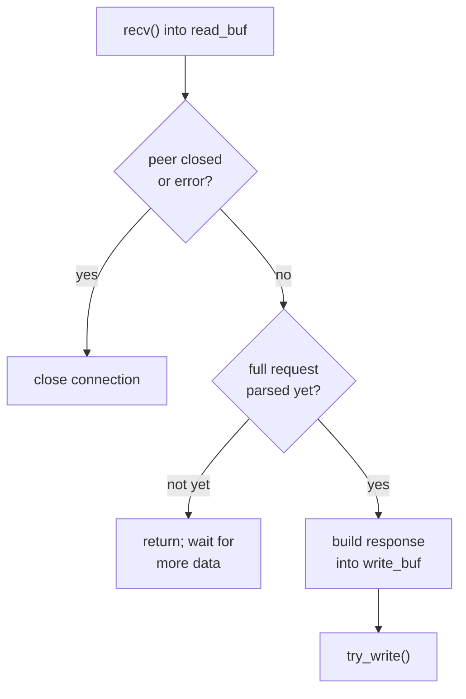
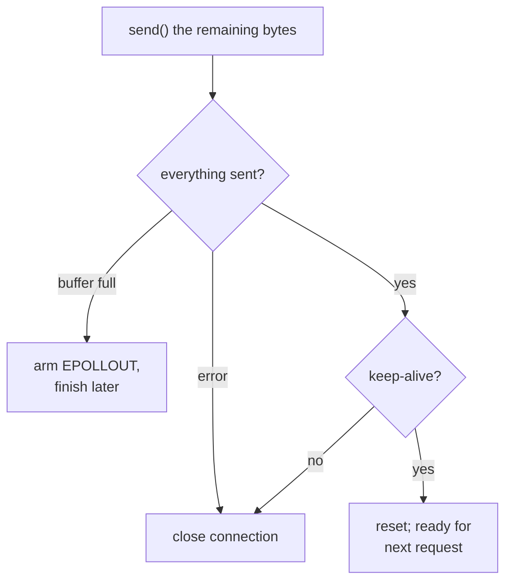

# Web Server

A minimal multi-threaded HTTP/1.1 server in C++20 using Linux `epoll` and `SO_REUSEPORT`.

## Build

**Dependencies:** CMake 3.14+, a C++20 compiler, `nlohmann-json` 3.2+

```bash
# Install nlohmann-json on Ubuntu
sudo apt install nlohmann-json3-dev

cmake -S . -B build
cmake --build build
```

## Run

```bash
./build/server
# Listening on port 8080
```

### Routes

| Method | Path    | Description                          |
| ------ | ------- | ------------------------------------ |
| GET    | `/ping` | Returns `pong`                       |
| POST   | `/echo` | Echoes the request body back as JSON |

```bash
curl http://localhost:8080/ping
curl -X POST http://localhost:8080/echo -d '{"hello":"world"}'
```

## Architecture

`SO_REUSEPORT` lets the kernel load-balance connections across shared-nothing
worker threads, each running its own `epoll` loop. Worker count defaults to 
the CPU count (`WORKERS=6 ./build/server` to override).



### Event loop

Each worker is level-triggered `epoll`. There are three pieces: the **dispatch
loop** that hands ready sockets to a handler, the **read handler**, and the
**write handler**. They're shown separately below.

**1. Dispatch loop.** `epoll_wait` sleeps until a socket is ready, then routes it
to a handler based on the event. Every handler returns here when it's done.



**2. Read handler (`on_read`).** Reads bytes, parses, and (once a full request is
in) builds the response and hands off to the write handler.



(A malformed request also lands in "build response", just with a `400` body.)

**3. Write handler (`try_write`).** Sends the response. The common case finishes
here without ever leaving read mode; it only defers to `EPOLLOUT` if the kernel's
send buffer is full.



## Benchmarking

`bench.sh` runs a reproducible load test against `GET /ping` with **wrk**.
A Release build is recommended, since a debug build benchmarks much slower.

```bash
# Install wrk on Ubuntu
sudo apt install wrk

cmake -S . -B build -DCMAKE_BUILD_TYPE=Release && cmake --build build
./bench.sh                  # defaults: 15s, 4 wrk threads, 128 connections
./bench.sh 30s 8 256        # duration, wrk threads, connections
WORKERS=8 ./bench.sh        # set server worker threads
```
